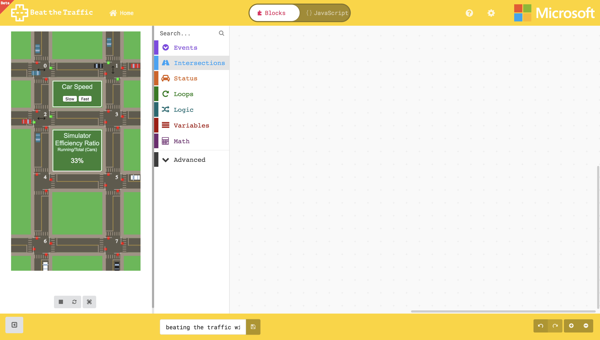
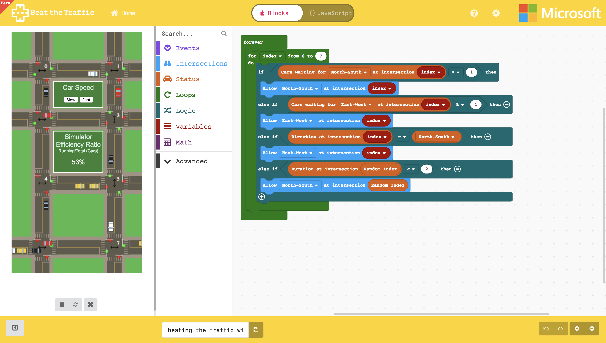

# Coraffic - Cornell MPS Program Team

## Traffic Simulator for Microsoft Makecode Editor
This program allows you to interact with traffic simulation using PXT ([Microsoft Programming Experience Toolkit](https://github.com/Microsoft/pxt))
- Try it alive: [https://liolop.github.io/Coraffic](https://liolop.github.io/Coraffic)

## Preview of the Editor



## Editor Example

- Preview of the Example


- Code Example

  Beat the Traffic - Event

  ```
  // Create event blocks
  events.onCarInter(0, function () {
      intersections.setDirAtInter(TLDir.NS, 0)
      intersections.setDirAtInter(TLDir.EW, 1)
      intersections.setDirAtInter(TLDir.NS, 2)
  })
  ```

  Beat the Traffic - Intersections

  ```
  /* Create controls of intersections' actions */

  // Create a forever loop
  loops.forever(function () {
    // Create a for loop for setting up the allowed directions to be North-South at all intersections
    for (let index = 0; index <= 7; index++) {
        intersections.setDirAtInter(TLDir.NS, index)
    }
  })
  ```

  Beat the Traffic - Status
  ```
  /* Use Status blocks to check conditions for controlling intersections

  loops.forever(function () {
    for (let index = 0; index <= 7; index++) {
        // Check number of cars waiting for North-South at intersection (index)
        if (status.getCarsWait(TLDir.NS, index) > 1) {
            intersections.setDirAtInter(TLDir.NS, index)
        } 
        // Check number of cars waiting for East-West at intersection (index)
        else if (status.getCarsWait(TLDir.EW, index) >= 1) {
            intersections.setDirAtInter(TLDir.EW, index)
        } 
        // Check allowed direction at intersection (index)
        else if (status.getDirection(index) == status.locParam(TLDir.NS)) {
            intersections.setDirAtInter(TLDir.EW, index)
        } 
        // Check how long has the allowed direction been set at a random intersection
        else if (status.getDuration(status.randIndex()) >= 2) {
            intersections.setDirAtInter(TLDir.NS, status.randIndex())
        }
    }
  })
  ```
## Running Locally
### Set up
- Install [node.js](https://nodejs.org/en/)
- Install PXT command line
  ```
  npm install -g pxt
  ```
- Install the dependencies

  ```
  npm install
  ```

### Running the local server

- After you're done, simple run this command to open a local web server:
  
  ```
  pxt serve
  ```

- Updating the tools

  ```
  pxt update
  ```

## More
More instructions at [https://github.com/Microsoft/pxt#running-a-target-from-localhost](https://github.com/Microsoft/pxt#running-a-target-from-localhost) 
